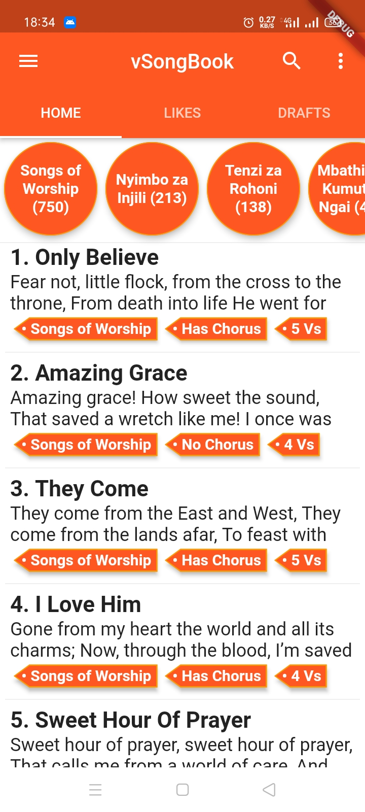
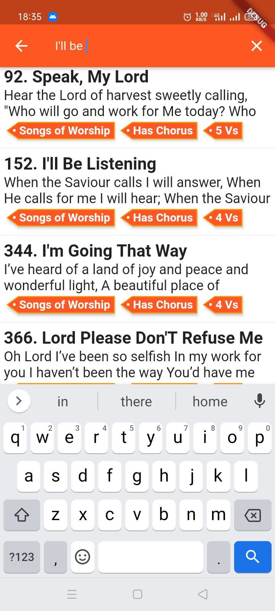
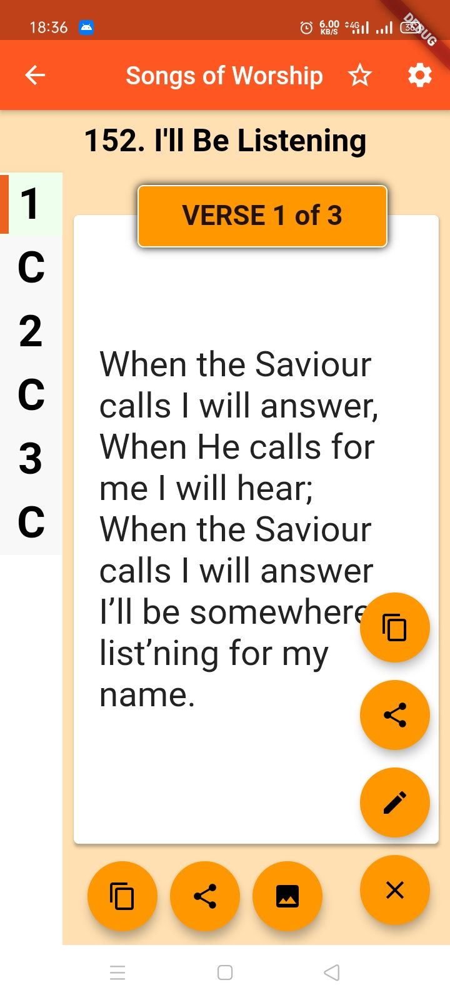
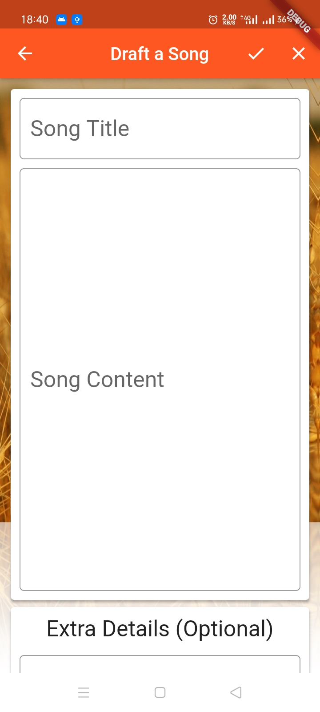

# vSongBook Mobile

 vSongBook app for both Android and iOS made possible with Flutter

**🚀🚀 New: vSongBook Mobile is now available in the browser! Check it out [here](https://sing.appsmata.com/).**
And note there are some limitations to the web variant.

## Screenshots
<table>
<tr>
<td></td>
<td></td>
<td></td>
<td></td>
</tr>
</table>

## Credits

This app is written with reference to many resources, including:

* AppSmata Android app: https://github.com/JacksiroKe/vSongAndy
* X-Wei's Flutter Catalog app: https://github.com/X-Wei/flutter_catalog